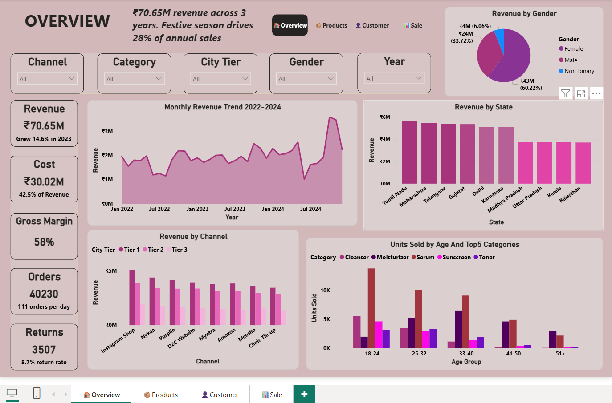
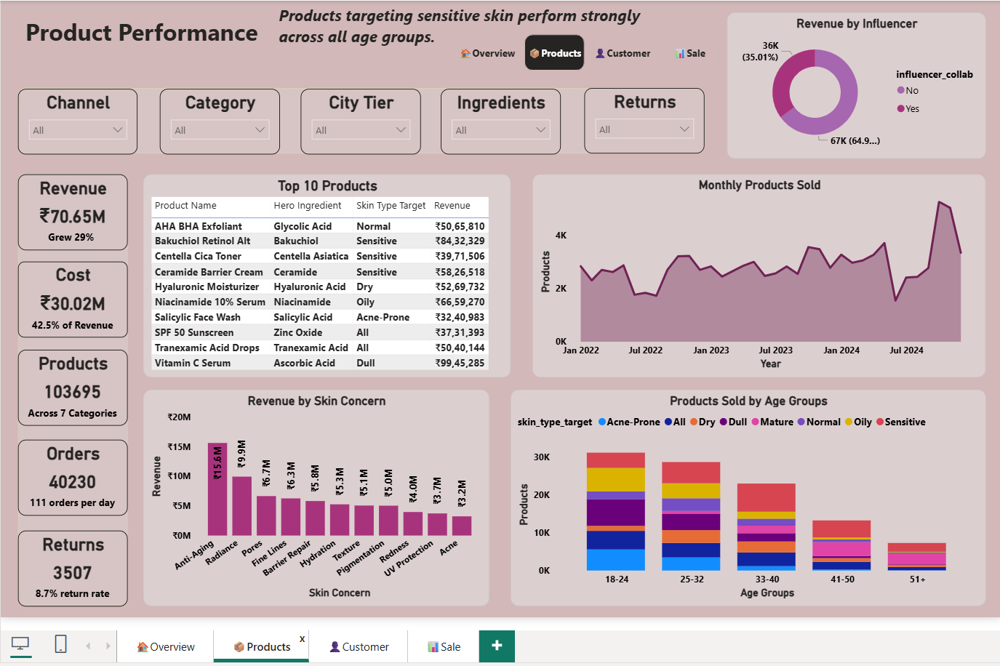
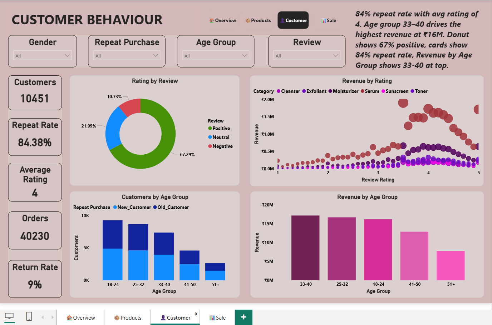
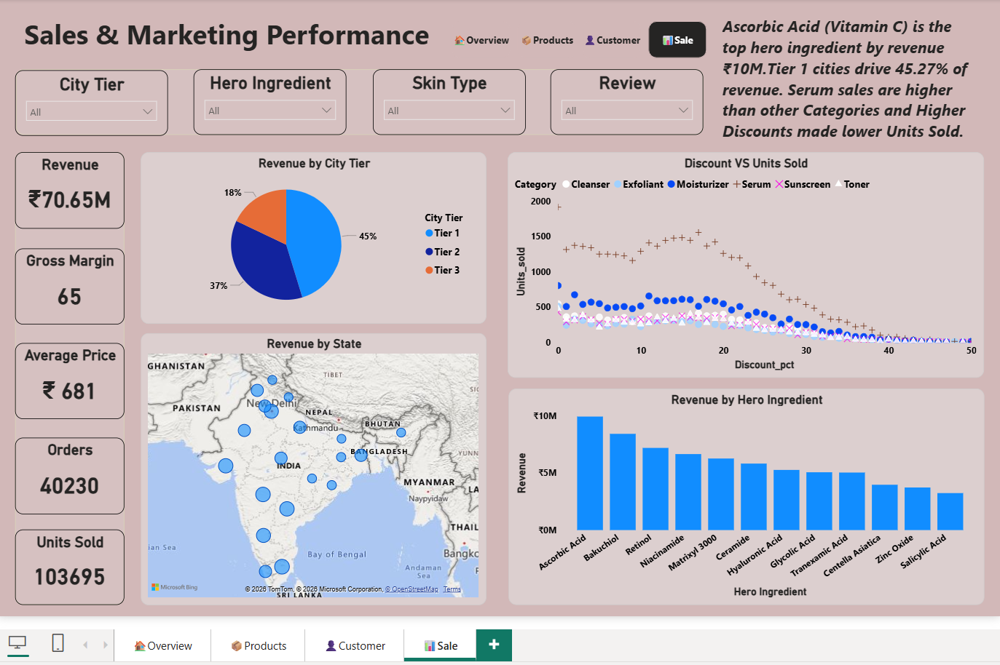

# Skincare Sales & Customer Analytics

**End-to-end analysis of 40,230 skincare orders across 8 channels and 10 Indian states using Excel, SQL, and Power BI to surface revenue patterns, return drivers, and discount strategy.**

---

## Tools Used
Microsoft Excel · SQL (MySQL) · Power BI (DAX, 15+ visuals)

---

## Dataset
- Source: India D2C Skincare Sales dataset
- Records: 40,230 orders · 24 columns
- File: `Skincare.csv`

---

## Data Cleaning Steps (Excel)
- Renamed all 24 column headers to lowercase with underscores
- Converted order_date to consistent DD-MM-YYYY format
- Changed data types — price_inr/cogs_inr to Decimal, units_sold/discount_pct to Integer
- Handled null values — return_reason nulls set to "N/A" for non-returned orders
- Created 3 calculated columns:
  - `revenue` = price_inr × units_sold
  - `total_cost` = cogs_inr × units_sold
  - `gross_margin_pct` = (price_inr − cogs_inr) / price_inr × 100

---

## Key Findings

- **Festive season drives 28% of annual revenue** — Oct–Nov concentration identified across all 3 years (2022–2024)
- **8.7% return rate exceeds industry benchmark** (5–7%) — Eye Cream at 11.1% and Serum at 10.5% are highest-risk SKUs
- **Discounts above 20% suppress unit sales** — SQL confirmed High-band (20%+) discounts reduce volume across all 7 categories; Medium-band (10–19%) consistently outperforms
- **Instagram Shop leads all channels at INR 108.56L** — overtaking Nykaa and Purplle across Tier 1 cities
- **Tier 3 cities = only 18% of revenue** — largest untapped growth opportunity in the dataset

---

## SQL Queries
10 business queries written and executed on a flat table (`skincare_data`), including:
- Revenue by channel and city tier
- Return rate by product category
- Discount band vs average units sold
- Window functions — RANK() OVER PARTITION BY category
- Top hero ingredients by gross margin %

See ` [Skincare.sql](https://github.com/user-attachments/files/26139765/Skincare.sql)
 ` for all queries with results.

---

## Dashboard Pages

### Page 1 — Overview

### Page 2 — Product Performance

### Page 3 — Customer Behaviour

### Page 4 — Sales & Marketing

---

## Files in This Repository

| File | Description |
|------|-------------|
| `Skincare.csv` | Full dataset — 40,230 records, 24 columns |
| `skincare_queries.sql` | All 10 SQL queries with business context |
| `images/` | All 4 dashboard page screenshots |
